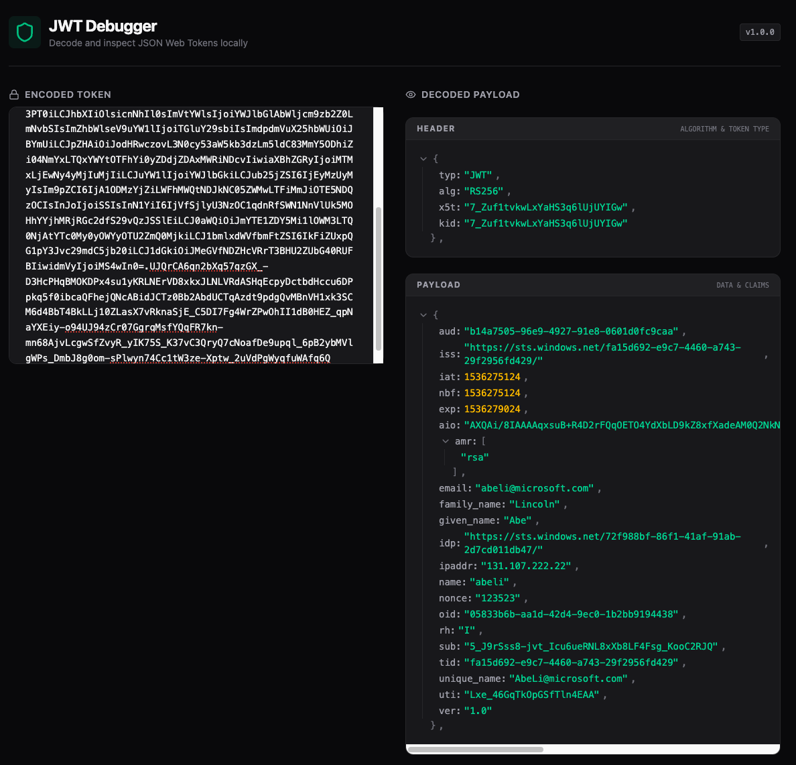
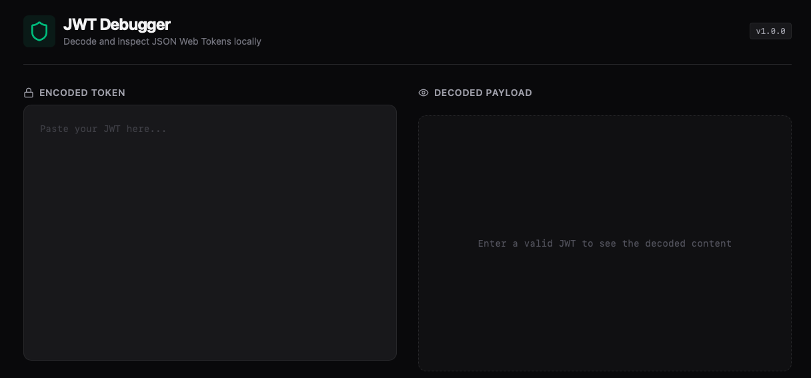
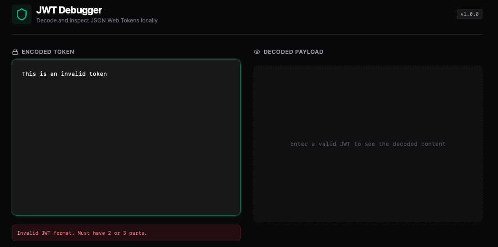

# JWT Debugger

A modern, high-performance, and secure JSON Web Token (JWT) debugger built with React and Tailwind CSS. This tool allows you to decode and inspect JWTs locally in your browser, ensuring your sensitive tokens never leave your machine.



## ✨ How to use
Download the `dist/index.html` file locally and double click it to run.

## ✨ Features

- **Local Decoding**: All decoding happens on the client side. Your tokens are never sent to any server.
- **Header & Payload Inspection**: View both the header (algorithm, token type) and payload (claims, data) in a structured format.
- **Interactive JSON Viewer**: Collapsible and color-coded JSON tree for easy exploration of complex payloads.
- **Error Validation**: Real-time feedback on invalid JWT formats or malformed tokens.
- **Modern UI**: Clean, dark-themed interface built with Tailwind CSS, Emerald accents, and Lucide icons.
- **Responsive Design**: Works seamlessly on desktops and tablets.

## 🚀 Tech Stack

- **Framework**: [React 19](https://react.dev/) (Vite)
- **Styling**: [Tailwind CSS 4.0](https://tailwindcss.com/)
- **Icons**: [Lucide React](https://lucide.dev/)
- **Language**: [TypeScript](https://www.typescriptlang.org/)

## 📖 Walkthrough: How to use

### 1. Paste your Encoded Token
When you open the application, you'll see a large text area on the left side labeled **"Encoded Token"**. Simply paste your JWT here.
*Note: A valid JWT consists of three parts separated by dots (e.g., `header.payload.signature`).*

### 2. Immediate Decoding
As soon as you paste a valid JWT, the application will automatically decode it. The right side of the screen, labeled **"Decoded Payload"**, will update to show two sections:
- **Header**: Contains information about the encryption algorithm and token type.
- **Payload**: Contains the actual data (claims) stored within the token.

### 3. Explore the Data
The decoded data is presented in an interactive JSON viewer. 
- Click the **chevron icons** (▶/▼) next to objects and arrays to expand or collapse them.
- Values are **color-coded** (strings in emerald, numbers in amber, booleans in blue) for better readability.

### 4. Handling Errors
If you paste an invalid string that isn't a properly formatted JWT, a red error message will appear below the input area explaining what went wrong (e.g., "Invalid JWT format" or "Failed to decode part").

---

## 🛠️ Installation & Development

### Prerequisites
- [Node.js](https://nodejs.org/) (v18 or higher recommended)
- [npm](https://www.npmjs.com/) or [yarn](https://yarnpkg.com/)

### Setup
1. Clone the repository:
   ```bash
   git clone <repository-url>
   cd jwtdecode
   ```

2. Install dependencies:
   ```bash
   npm install --include=dev
   ```

3. Start the development server:
   ```bash
   npm run dev
   ```

4. Build for production:
   ```bash
   npm run build
   ```

## 🧪 Testing
The project uses Vitest for unit testing. You can run the tests using:
```bash
npm test
```

## 🛡️ Privacy & Security
This application is designed with security in mind. It uses the browser's `atob` and `decodeURIComponent` APIs to decode tokens. No data is stored or transmitted externally.

---

## 📸 Screenshots

### Empty State
When you first load the app, you'll see an empty editor on the left and a placeholder on the right.


### Decoded Token
Once a token is pasted, the payload is displayed in a structured, color-coded format.


### Error State
If an invalid token is provided, a helpful error message helps you identify the issue.

